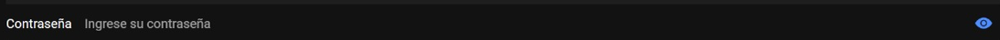

 <ion-content class="ion-padding">
      <!-- Barra de búsqueda -->
      <ion-searchbar show-cancel-button="always" placeholder="Contenidos"></ion-searchbar>

<!-- Botones de Iniciar Sesión y Registro -->
''
      

        <ion-button id="present-alert">Iniciar sesión</ion-button>
        <ion-button id="present-alert" color="secondary">Registrarse</ion-button>
      

<!-- Campos de entrada de datos del usuario -->
''
      <ion-input label="Nombre" placeholder="Ingrese su nombre"></ion-input>
      <ion-input label="Apellido" placeholder="Ingrese su apellido"></ion-input>
      <ion-input label="Teléfono" type="tel" placeholder="888-888-8888"></ion-input>

<!-- Campo de Email -->
''
      <ion-list>
        <ion-item>
          <ion-input label-placement="floating" placeholder="correo@example.com">
            
Email

          </ion-input>
        </ion-item>
      </ion-list>

 <!-- Campo de Contraseña -->
 ''
      <ion-input type="password" label="Contraseña" placeholder="Ingrese su contraseña">
        <ion-input-password-toggle slot="end"></ion-input-password-toggle>
      </ion-input>

<!-- Campo de Motivo de Consulta -->
''
      <ion-item>
        <ion-input
          label="Motivo de consulta"
          label-placement="stacked"
          :clear-input="true"
          placeholder="Comente acá su motivo de consulta"
        >
        </ion-input>
      </ion-item>

      <!-- Grid de ejemplo -->
      <ion-grid>
        <ion-row>
          <ion-col>1</ion-col>
          <ion-col>2</ion-col>
          <ion-col>3</ion-col>
          <ion-col>4</ion-col>
          <ion-col>5</ion-col>
        </ion-row>
      </ion-grid>